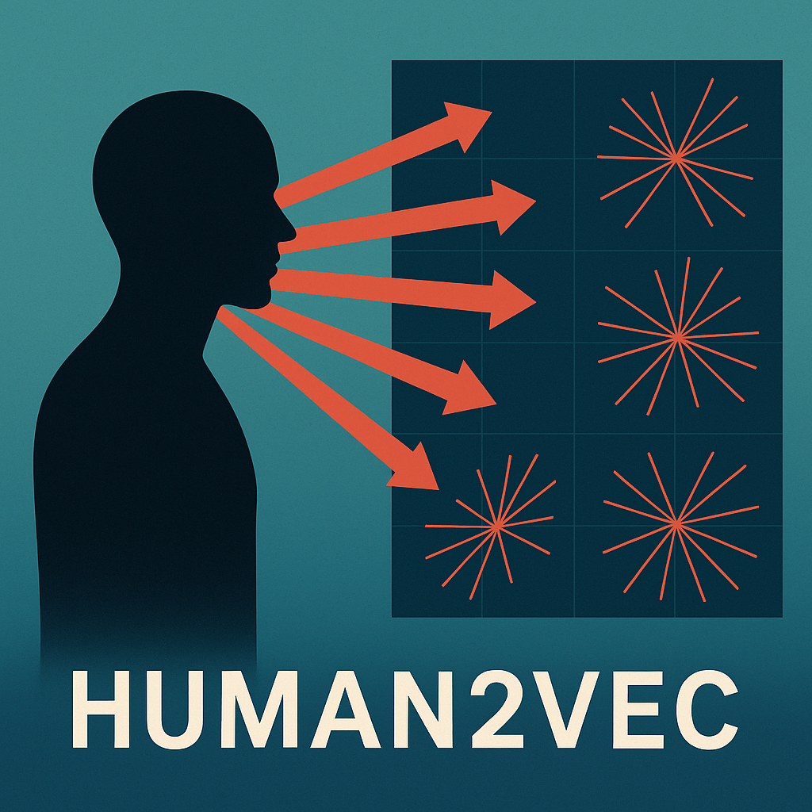

# human2vec

Welcome to `human2vec`! This is a set of tools that allow for two primary purposes:

1. Given a set of individuals and referrals given within that network, calculate "compatible" individuals based on those referrals given via an embedding model.

2. Visualize compatibility relationships and directional relationships of referrals given using PCA, t-SNE, UMAP, and a directional galaxy diagram.

## Primary Files

Within this directory, you will find three important files: `generate_data.py`, `embed_humans.ipynb`, and `visualize.ipynb`.

### generate_data.py

If one is lacking data, they can use this file to generate a series of mock names and referrals to create the social network. 

Names are generated through Python's Faker library, and referrals are generated from pre-set templates in the JSON produced by the `referral_templates.py` file, to updated as desired.

### embed_humans.py

With a set of referrals, we can use HuggingFace's famed `SentenceTransformer` to embed each human as a mean-pooled set of their received referrals into an n-D space.

We can then visualize similarity/compatibility using a Heatmap and find the most viable candidates for any individual using a top_k similarity method.

### visualize.ipynb

Given the member to referrals received data, there are 2D and 3D PCA, t-SNE, and UMAP diagrams indicating compatibility clusters.

Given the member to member referrals given, there is a 3D directional galaxy diagram to explore relationships among individuals.

To open these visualizations, download the `html` files and open them locally in your browser.

## Support Files (in /data)

The `preprocess` folder contains data related to the pre-embedding work (including the list of member first names, the list of referrals given, etc.).

The `process` folder contains data related to the embedding work, that being the referrals given and the numerical embeddings themselves (in `human_embeddings.json`). 

The `postprocess` folder contains all visualizations resulting from the aforementioned processes.